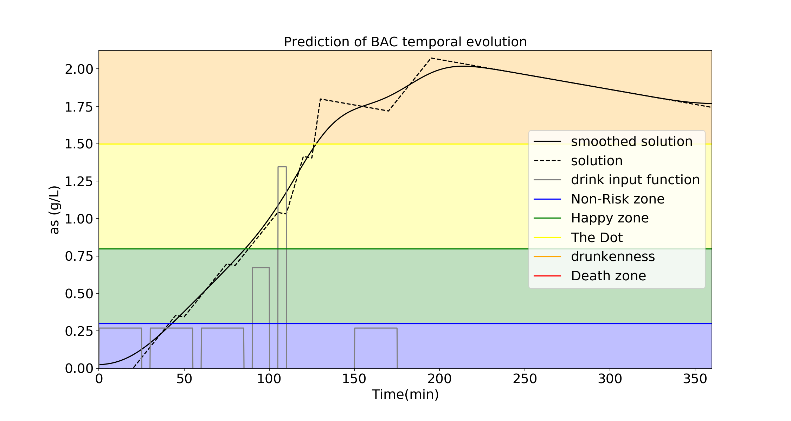

# Cogorza

A program to predict BAC in bloodstream giving a set of drinks by assuming mass conservation.

----
### Requirements:
 
+ python 3
+ numpy
+ pandas
+ matplotlib
+ scipy

----
### Resources: 

+ An implementation of Python program is provided in Cogorza.py file. The same implementation is provided in jupyter notebook version (Cogorza.ipynb).

+ In fortan folder, fortran source code examples are provided

+ BACPY.csv is the output data file provided by running the program

+ The "Ouput" folder, a set of output examples are presented as png files. Example:

--- 

### Input parameters:
### How to run Cogorza:

To run it using python :

+ In CLI, just type "python Cogorza.py"

To run using fortran: 

+ Compile source code on Linux: gfortran Cogorza.f95 -O Cogorza
+ Run generated executable file: ./Cogorza

